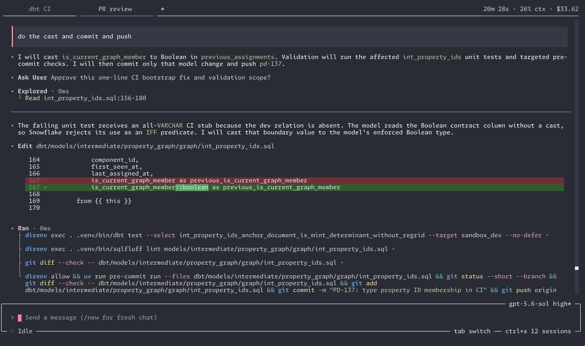
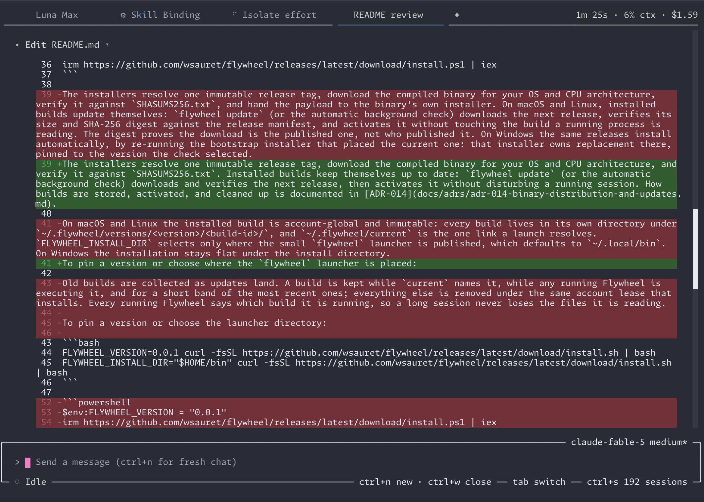
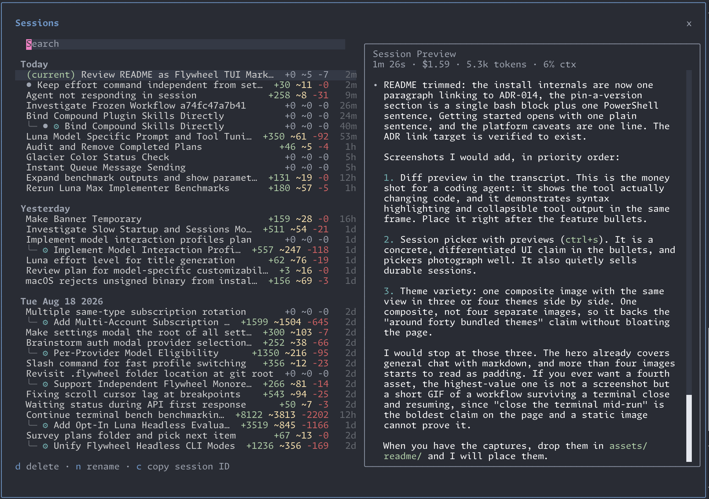
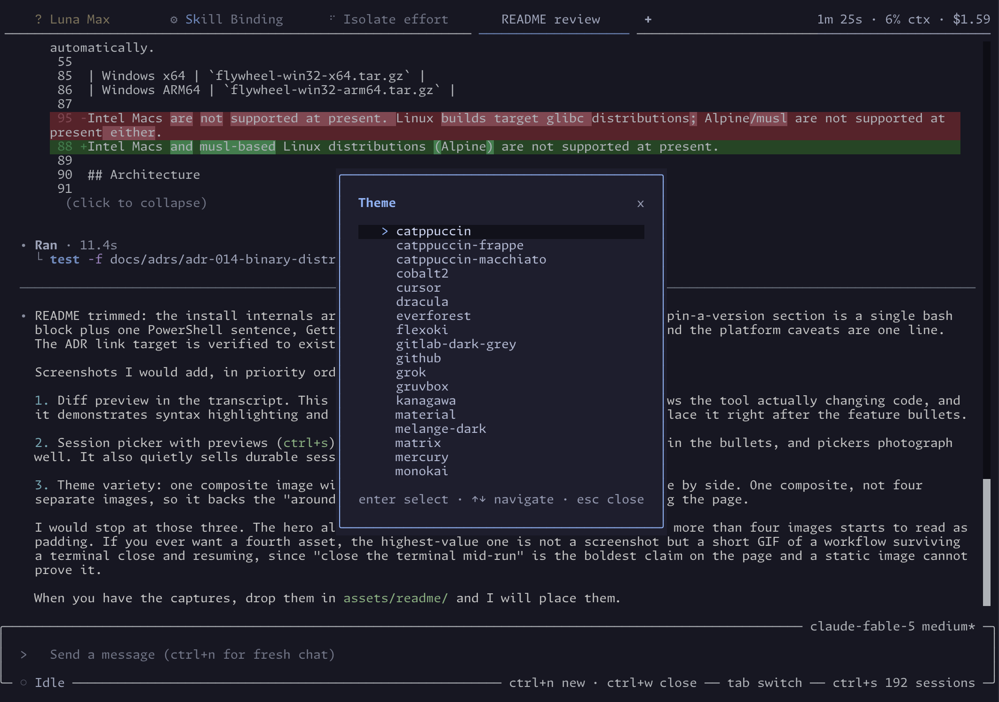
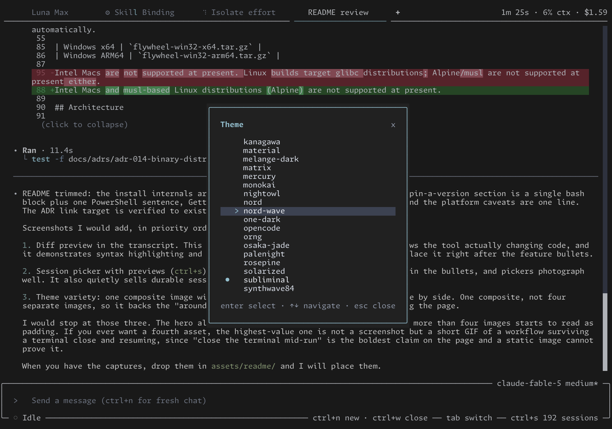

# Flywheel

<p align="center"><b>A greatest-hits coding agent in a beautiful terminal UI.</b></p>

<p align="center">
  <a href="LICENSE"></a>
  <a href="https://github.com/wsauret/flywheel/releases/latest"></a>
  
  
</p>

<p align="center"></p>

Flywheel is a coding agent that lives in a beautiful native terminal UI. It is a greatest-hits compilation of the best ideas from every agent harness I have used, rebuilt on one disciplined foundation: every model call, tool run, and workflow step is recorded as typed evidence you can search, replay, and learn from. Agents propose; deterministic code owns durable state.

- **A TUI worth looking at.** A carefully designed visual experience with mouse support, live markdown and syntax highlighting, collapsible tool output, diff previews, a session picker with session previews, and around forty bundled themes. Ships with the Monaspace terminal font (`flywheel font`) for the best viewing experience.
- **Durable workflows.** Multi-step agent workflows compile to a deterministic queue with verification between steps, retries with feedback, pause and resume, and crash recovery. Close the terminal mid-run; the workflow resumes from its recorded state. A headless mode (`flywheel --headless`) runs the same workflows in CI.
- **Subscriptions first, API keys as fallback.** Sign in with a subscription you already pay for: ChatGPT, GitHub Copilot, SuperGrok, or OpenCode Go. You can sign in to several accounts of the same subscription; when one hits its cap, the turn rotates through the rest automatically before falling back to your API keys (Anthropic, OpenAI, Google, OpenRouter, or any custom OpenAI-compatible endpoint). Which provider served each turn is a recorded fact, not a guess.
- **Everything is inspectable.** Sessions are event-sourced into a local SQLite store, and runtime diagnostics stream to a structured JSONL log. `flywheel events search` answers "what actually happened" across both on one timeline, with facts, not log archaeology.
- **It learns, with consent.** Skills and a curated memory accumulate from real session outcomes, are stored as reviewable files, and can be traced back to the sessions that produced them (`flywheel skills:why`).
- **Plays well with your stack.** MCP servers over stdio or HTTP with OAuth (`flywheel mcp add`, `mcp login`), one-command import of a Claude Code `.mcp.json`.
- **As minimal as you want it.** Workflows, skills, subagents, learning, and background commands are each a single toggle. If you disable a capability, every aspect of it disappears entirely: the tools, prompts, and commands are all gone. A plain, fast, efficient chat agent is a supported configuration.

<p align="center">
  
  
</p>

<p align="center">
  
  
</p>

<p align="center"><sub>Diff previews, the session picker, and two of the bundled themes.</sub></p>

## Install

### macOS and Linux

```bash
curl -fsSL https://github.com/wsauret/flywheel/releases/latest/download/install.sh | bash
```

### Windows

Run this from PowerShell:

```powershell
irm https://github.com/wsauret/flywheel/releases/latest/download/install.ps1 | iex
```

The installers resolve one immutable release tag, download the compiled binary for your OS and CPU architecture, and verify it against `SHASUMS256.txt`. Installed builds keep themselves up to date: `flywheel update` (or the automatic background check) downloads and verifies the next release, then activates it without disturbing a running session.

To pin a version or choose where the `flywheel` launcher is placed:

```bash
FLYWHEEL_VERSION=0.0.1 curl -fsSL https://github.com/wsauret/flywheel/releases/latest/download/install.sh | bash
FLYWHEEL_INSTALL_DIR="$HOME/bin" curl -fsSL https://github.com/wsauret/flywheel/releases/latest/download/install.sh | bash
```

On PowerShell, set `$env:FLYWHEEL_VERSION` before running the installer.

## Getting started

Run `flywheel` in a project directory. Flywheel finds the project root automatically, asks once if it is ambiguous, and records the choice in a `.flywheel/` directory there, so every later launch from a nested directory lands in the same project.

On first launch, with no provider connected yet, the provider picker opens by itself: sign in with a subscription (ChatGPT, GitHub Copilot, SuperGrok, OpenCode Go) or paste an API key (Anthropic, OpenAI, Google, OpenRouter, or a custom OpenAI-compatible endpoint). `/auth` reopens it anytime. Credentials are stored in account-global auth profiles, so signing in once covers every project, and `/profile` switches profiles when you keep separate accounts.

Then just start chatting: explore the code, weigh options, shape a design. `/models` switches models, `ctrl+s` manages sessions, and `/workflow:<id>` launches a workflow.

Project state lives in the selected project's `.flywheel/` directory; account-global settings live in `~/.flywheel/flywheel.toml`. For scripts and CI, the same authentication works headlessly: `flywheel auth login`, `flywheel auth status`, and `--auth-profile` to select the profile for one invocation.

## Workflows

Agents produce plausible code in a single pass. Plausible code runs the happy path, but well-architected, fast, safe, idiomatic, and elegant are different concerns that don't all surface from one vantage point. Flywheel's workflows force re-evaluation from independent reviewer perspectives — architecture, code quality, data integrity, elegance, conventions, performance — at the two moments where attention has the most leverage:

| Review target | Prevents |
|---------------|----------|
| Plans | Hundreds of bad lines |
| Code | Individual mistakes |

The full cycle — plan → review → refine → implement → review → fix — runs as one durable workflow (`/workflow:<id>`) with verification between steps. Each step is a full agent that dispatches its own subagents in fresh contexts, so the main thread stays compact. Workflows survive crashes and terminal restarts, and run headlessly in CI.

## Inspect everything

Every session writes typed facts to `.flywheel/flywheel.sqlite` and structured diagnostics to `.flywheel/log/*.jsonl`, and Flywheel ships one tool that queries both as a single timeline:

```bash
flywheel events search --errors --latest
flywheel events search --type model.requested --latest --limit 5
flywheel events search --session <sessionId> --around <position> -C 20
flywheel memory:show
flywheel skills:why <name>
```

## Verify a release

Releases are built and published by an automated pipeline; no build or upload happens from a developer machine. Every archive is verified against its stated digest before publication, and you can repeat that check yourself:

```bash
tmp=$(mktemp -d)
curl -fsSL https://github.com/wsauret/flywheel/releases/latest/download/SHASUMS256.txt -o "$tmp/SHASUMS256.txt"
curl -fsSL https://github.com/wsauret/flywheel/releases/latest/download/flywheel-darwin-arm64.tar.gz -o "$tmp/flywheel-darwin-arm64.tar.gz"
(cd "$tmp" && shasum -a 256 -c SHASUMS256.txt --ignore-missing)
```

`release.json` on each release states the immutable tag-addressed URL and digest of every archive.

## Supported binary targets

Release builds are compiled binaries, not raw TypeScript source. Each archive includes the `flywheel-bin` executable, native runtime assets, bundled fonts, and the `build.json` that states the build's version and identity.

| Platform | Archive |
|---|---|
| macOS ARM64 | `flywheel-darwin-arm64.tar.gz` |
| Linux x64 | `flywheel-linux-x64.tar.gz` |
| Linux ARM64 | `flywheel-linux-arm64.tar.gz` |
| Windows x64 | `flywheel-win32-x64.tar.gz` |
| Windows ARM64 | `flywheel-win32-arm64.tar.gz` |

Intel Macs and musl-based Linux distributions (Alpine) are not supported at present.

## Claude Code plugin

Flywheel began as a plugin for Claude Code and OpenCode, and that plugin lives on in this repository under [`flywheel/`](flywheel/). It is a separate, self-contained product that brings Flywheel-style planning and review workflows to Claude Code; the terminal UI does not require it. The install commands you may already know keep working:

```
/plugin marketplace add wsauret/flywheel
/plugin install flywheel@flywheel-marketplace
```

See the [plugin README](flywheel/README.md) for its full documentation, including OpenCode installation.

## About this repository

This repository distributes Flywheel: the compiled release binaries and installers land here, and the Claude Code plugin's source lives here. The agent itself is developed in a private repository for now.

The design is inspired by my favorite aspects of the wonderful harnesses that have been released, such as [Amp](https://ampcode.com), [Pi](https://pi.dev), [Opencode](https://opencode.ai), [Codex](https://developers.openai.com/codex), [Claude Code](https://claude.com/claude-code), [Hermes](https://hermes-agent.nousresearch.com), [Grok Build](https://x.ai/cli), and [Droid](https://factory.ai). You may see aspects of their design choices sprinkled across Flywheel, but it should also be apparent that the way they come together is to form something new and different.

## License

[MIT](LICENSE)
