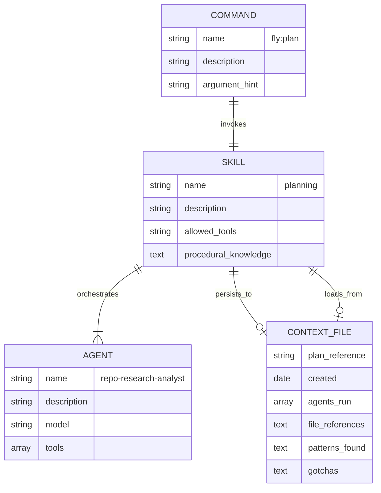
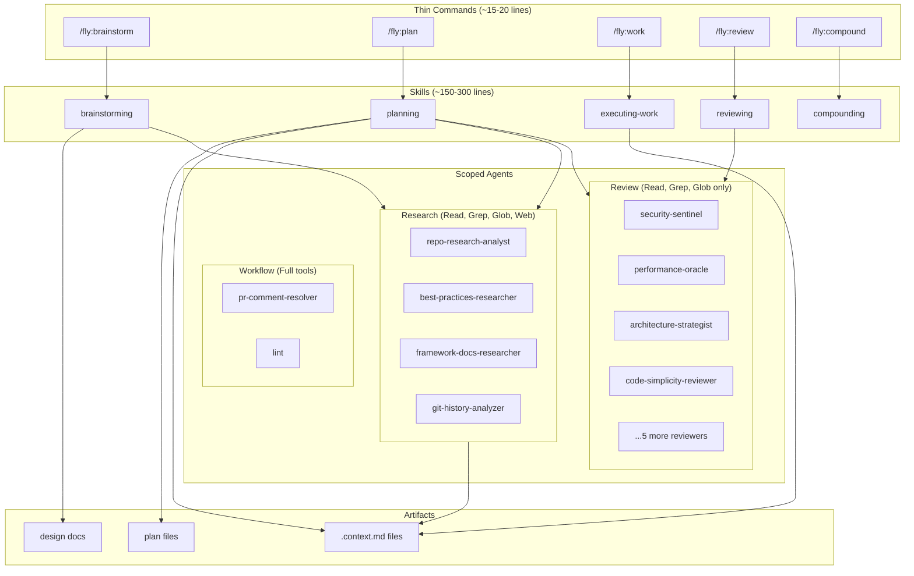

# Refactor: Skill-Centric Architecture Migration

## Overview

Migrate the Flywheel plugin from monolithic workflow commands (370-783 lines each) to a skill-centric architecture with thin commands (~15-20 lines) invoking focused skills (~150-300 lines). This improves token efficiency through research persistence, maintainability through separation of concerns, and user experience through auto-activation.

## Problem Statement / Motivation

**Current pain points:**

1. **Token inefficiency**: Research output accumulates in context window; full workflows can fill context
2. **Inconsistent research persistence**: `.context.md` files exist but are used inconsistently
3. **Poor maintainability**: Commands are 370-783 lines, mixing orchestration with procedural knowledge
4. **No auto-activation**: Users must know and type explicit `/workflows:*` commands

**Why this matters:**

- Context window exhaustion causes workflow failures
- Large commands are hard to modify and debug
- New users don't discover workflow commands
- Research is repeated instead of reused

## Proposed Solution

**Hybrid skill-centric architecture with research persistence:**

```
/fly:brainstorm  ─→  brainstorming skill (~150 lines)
/fly:plan        ─→  planning skill (~300 lines, includes deepen + review)
/fly:work        ─→  executing-work skill (~200 lines)
/fly:review      ─→  reviewing skill (~150 lines)
/fly:compound    ─→  compounding skill (~100 lines)
```

**Key innovations:**

1. **Research persistence pattern**: All research persists to `.context.md` files and clears from context
2. **Scoped agent tools**: Review agents get read-only access (Read, Grep, Glob)
3. **Auto-activation**: Skills trigger on natural language in addition to explicit commands
4. **Merged review_plan**: Planning skill includes create, deepen, and review phases

## Technical Approach

### Target Directory Structure

```
plugin/
├── skills/                           # Detailed procedural knowledge
│   ├── brainstorming/
│   │   └── SKILL.md                  # ~150 lines
│   ├── planning/
│   │   ├── SKILL.md                  # ~250-300 lines
│   │   └── references/
│   │       └── plan-templates.md
│   ├── executing-work/
│   │   └── SKILL.md                  # ~200 lines
│   ├── reviewing/
│   │   ├── SKILL.md                  # ~150 lines
│   │   └── checklists/
│   ├── compounding/
│   │   └── SKILL.md                  # ~100 lines
│   ├── file-todos/                   # (existing, unchanged)
│   ├── compound-docs/                # (existing, unchanged)
│   └── git-worktree/                 # (existing, unchanged)
│
├── agents/                           # Scoped parallel workers
│   ├── research/                     # Tools: Read, Grep, Glob, WebFetch, WebSearch
│   ├── review/                       # Tools: Read, Grep, Glob
│   └── workflow/                     # Tools: Read, Write, Edit, Bash, Grep, Glob
│
├── commands/
│   ├── fly/                          # New thin commands (~15-20 lines each)
│   │   ├── brainstorm.md
│   │   ├── plan.md
│   │   ├── work.md
│   │   ├── review.md
│   │   └── compound.md
│   └── workflows/                    # DELETE after migration
│
└── README.md
```

### Implementation Phases

#### Phase 1: Foundation & Brainstorming Skill

**Goal:** Build the first workflow entry point, validate research persistence pattern early.

**Why brainstorming first:**
- Natural entry point in workflow (brainstorm -> plan -> work -> review)
- Tests research persistence from the very start
- Creates `-design.md` files that planning skill consumes
- Validates the pattern before building more complex skills

**Tasks:**

1. Create directory structure
   - [ ] `mkdir -p plugin/skills/brainstorming`
   - [ ] `mkdir -p plugin/skills/planning/references`
   - [ ] `mkdir -p plugin/skills/executing-work`
   - [ ] `mkdir -p plugin/skills/reviewing/checklists`
   - [ ] `mkdir -p plugin/skills/compounding`
   - [ ] `mkdir -p plugin/commands/fly`

2. Build brainstorming skill (`plugin/skills/brainstorming/SKILL.md`)
   - [ ] Extract silent research phase from `workflows/brainstorm.md` (Phase 1)
   - [ ] Implement research persistence pattern (run agents -> persist to context -> clear)
   - [ ] Extract conversational questioning flow (Phase 2: one question at a time)
   - [ ] Extract approach exploration (Phase 3: always present 2-3 approaches)
   - [ ] Extract incremental design validation (Phase 4: 200-300 word chunks)
   - [ ] Extract design document creation (Phase 5: save to `-design.md`)
   - [ ] Add auto-activation description pattern (triggers on "explore", "brainstorm", "think about")
   - [ ] Target: ~150 lines

3. Create thin `/fly:brainstorm` command
   - [ ] `plugin/commands/fly/brainstorm.md` (~15-20 lines)
   - [ ] Invokes brainstorming skill
   - [ ] Passes `$ARGUMENTS` through

4. Test brainstorming flow
   - [ ] Run `/fly:brainstorm "test feature"`
   - [ ] Verify research agents run silently (output not dumped to user)
   - [ ] Verify conversational flow works (one question at a time)
   - [ ] Verify design doc created at `plans/<topic>-design.md`

#### Phase 2: Planning Skill

**Goal:** Build the most complex skill, consumes design docs from brainstorming.

**Tasks:**

1. Build planning skill (`plugin/skills/planning/SKILL.md`)
   - [ ] Extract input detection logic from `workflows/plan.md` (design doc vs feature description)
   - [ ] Extract research orchestration from `workflows/plan.md`
   - [ ] Extract deepening logic from `workflows/review_plan.md` (Stage 1)
   - [ ] Extract review coordination from `workflows/review_plan.md` (Stage 2)
   - [ ] Implement research persistence pattern
   - [ ] Add auto-activation description pattern (triggers on "plan", "create a plan", "implement")
   - [ ] Target: ~250-300 lines

2. Create plan-templates reference
   - [ ] Extract MINIMAL/MORE/A LOT templates to `references/plan-templates.md`
   - [ ] Reference from main SKILL.md

3. Create thin `/fly:plan` command
   - [ ] `plugin/commands/fly/plan.md` (~15-20 lines)
   - [ ] Invokes planning skill
   - [ ] Passes `$ARGUMENTS` through

4. Test integration with brainstorming
   - [ ] Run `/fly:brainstorm` then `/fly:plan plans/<topic>-design.md`
   - [ ] Verify planning skill detects and uses design doc
   - [ ] Verify research persistence works
   - [ ] Verify plan + context files created

#### Phase 3: Executing-Work Skill

**Goal:** Test that `.context.md` loading works from downstream skill.

**Tasks:**

1. Build executing-work skill (`plugin/skills/executing-work/SKILL.md`)
   - [ ] Extract execution logic from `workflows/work.md`
   - [ ] Implement `.context.md` loading at start
   - [ ] Follow "File References" section to load files
   - [ ] Reference "Gotchas & Warnings" for safety
   - [ ] Target: ~200 lines

2. Create thin `/fly:work` command
   - [ ] `plugin/commands/fly/work.md` (~15-20 lines)

3. Test full flow integration
   - [ ] Run `/fly:brainstorm` -> `/fly:plan` -> `/fly:work`
   - [ ] Verify context file loads correctly in work phase
   - [ ] Verify no duplicate research across phases

#### Phase 4: Remaining Skills

**Tasks (can run in parallel):**

1. Build reviewing skill
   - [ ] Extract from `workflows/review_work.md`
   - [ ] Coordinates review agents on code (not plans)
   - [ ] Target: ~150 lines
   - [ ] Create `/fly:review` command

2. Build compounding skill
   - [ ] Extract from `workflows/compound.md`
   - [ ] Target: ~100 lines
   - [ ] Create `/fly:compound` command

#### Phase 5: Agent Tool Scoping

**Goal:** Add tool restrictions to all 16 agents.

**Tasks:**

1. Update research agents (4 agents)
   - [ ] `repo-research-analyst.md`: Add `tools: [Read, Grep, Glob, WebFetch]`
   - [ ] `best-practices-researcher.md`: Add `tools: [Read, Grep, Glob, WebFetch, WebSearch]`
   - [ ] `framework-docs-researcher.md`: Add `tools: [Read, Grep, Glob, WebFetch, WebSearch]`
   - [ ] `git-history-analyzer.md`: Add `tools: [Read, Grep, Glob, Bash]`

2. Update review agents (9 agents)
   - [ ] `security-sentinel.md`: Add `tools: [Read, Grep, Glob]`
   - [ ] `performance-oracle.md`: Add `tools: [Read, Grep, Glob]`
   - [ ] `architecture-strategist.md`: Add `tools: [Read, Grep, Glob]`
   - [ ] `code-simplicity-reviewer.md`: Add `tools: [Read, Grep, Glob]`
   - [ ] `data-integrity-guardian.md`: Add `tools: [Read, Grep, Glob]`
   - [ ] `pattern-recognition-specialist.md`: Add `tools: [Read, Grep, Glob]`
   - [ ] `agent-native-reviewer.md`: Add `tools: [Read, Grep, Glob]`
   - [ ] `python-reviewer.md`: Add `tools: [Read, Grep, Glob]`
   - [ ] `typescript-reviewer.md`: Add `tools: [Read, Grep, Glob]`

3. Update workflow agents (3 agents)
   - [ ] `pr-comment-resolver.md`: Add `tools: [Read, Write, Edit, Bash, Grep, Glob]`
   - [ ] `spec-flow-analyzer.md`: Add `tools: [Read, Grep, Glob]`
   - [ ] `lint.md`: Add `tools: [Read, Bash]`

#### Phase 6: Testing & Polish

**Tasks:**

1. Full workflow test
   - [ ] Run complete flow: brainstorm -> plan -> work -> review -> compound
   - [ ] Verify research persistence at each stage
   - [ ] Measure token usage vs old commands
   - [ ] Test auto-activation on natural language

2. Edge case testing
   - [ ] Test mid-stream entry (e.g., `/fly:work` without prior `/fly:plan`)
   - [ ] Test plan iteration (`/fly:plan` on existing plan)
   - [ ] Test error recovery and partial results

3. Documentation
   - [ ] Update plugin README.md with new command structure
   - [ ] Document migration from `/workflows:*` to `/fly:*`

#### Phase 7: Cleanup

**Tasks:**

1. Delete old commands
   - [ ] Remove `plugin/commands/workflows/brainstorm.md`
   - [ ] Remove `plugin/commands/workflows/plan.md`
   - [ ] Remove `plugin/commands/workflows/review_plan.md`
   - [ ] Remove `plugin/commands/workflows/work.md`
   - [ ] Remove `plugin/commands/workflows/review_work.md`
   - [ ] Remove `plugin/commands/workflows/compound.md`
   - [ ] Remove `plugin/commands/workflows/` directory if empty

2. Final verification
   - [ ] Verify all `/fly:*` commands work
   - [ ] Verify no references to old `/workflows:*` commands remain

## Code Examples

### Thin Command Example (`plugin/commands/fly/plan.md`)

```markdown
---
name: fly:plan
description: Create or refine implementation plans with research persistence. Supports design docs, feature descriptions, or existing plans.
argument-hint: "[feature description OR path to *-design.md OR path to existing plan]"
---

# Create or Refine Plans

<input> #$ARGUMENTS </input>

**Invoke the planning skill:**

```
skill: planning
```

The planning skill handles:
- Input detection (design doc, feature, existing plan)
- Research orchestration with persistence
- Plan creation with appropriate detail level
- Deepening with additional research
- Review with parallel reviewer agents
- Handoff to `/fly:work`

See `plugin/skills/planning/SKILL.md` for full procedural details.
```

### Research Persistence Pattern Example

```markdown
## Research Persistence (in planning skill)

### Step 1: Run Research Agents in Parallel

Run these agents simultaneously:
- Task repo-research-analyst(feature_description)
- Task best-practices-researcher(feature_description)
- Task framework-docs-researcher(feature_description)

### Step 2: Persist to Context File

Write findings to `plans/<plan-name>.context.md`:

```yaml
---
plan: <plan-filename>.md
created: <date>
agents_run:
  - repo-research-analyst
  - best-practices-researcher
  - framework-docs-researcher
---

## File References
- src/file.ts:42 - relevant code

## Patterns Found
- Pattern 1: Description

## Gotchas & Warnings
- Warning 1: Description
```

### Step 3: Clear Research from Context

After writing context file, research output is no longer needed in conversation.
Downstream skills load from `.context.md` file.

### Step 4: Downstream Loading (in executing-work skill)

```bash
CONTEXT_FILE="${PLAN_PATH%.md}.context.md"
if [ -f "$CONTEXT_FILE" ]; then
  # Load file references section
  # Note gotchas and warnings
  # Skip re-research
fi
```
```

### Agent Tool Scoping Example

```yaml
# plugin/agents/review/security-sentinel.md
---
name: security-sentinel
description: "Use this agent when..."
model: inherit
tools:
  - Read
  - Grep
  - Glob
---
```

## Acceptance Criteria

### Functional Requirements

- [ ] All 5 `/fly:*` commands work correctly
- [ ] Skills invoke appropriate agents in parallel
- [ ] Research persists to `.context.md` files
- [ ] Downstream skills load from `.context.md` without re-researching
- [ ] Auto-activation triggers on natural language (>80% accuracy)
- [ ] Agent tool scoping restricts access appropriately

### Non-Functional Requirements

- [ ] Command files are ~15-20 lines (down from 370-783)
- [ ] Skill files are ~150-300 lines (focused, single purpose)
- [ ] Overall context reduction >30% for full workflow
- [ ] No research agent output remains in context after persistence

### Quality Gates

- [ ] Full workflow test passes (brainstorm -> plan -> work -> review -> compound)
- [ ] Token usage measurement shows improvement
- [ ] All old `/workflows:*` commands deleted
- [ ] No broken references to old commands

## Success Metrics

| Metric | Current | Target | Measurement |
|--------|---------|--------|-------------|
| Lines per command | 370-783 | 15-20 | Line count |
| Lines per skill | N/A | 150-300 | Line count |
| Research in context | Full agent output | 0 (persisted to file) | Manual check |
| Context reuse | Manual copy/paste | Auto-load from file | Observation |
| Auto-activation | 0% | >80% | User testing |

## Dependencies & Prerequisites

- [ ] Claude Code plugin framework supports tool scoping syntax
- [ ] `skills/` directory structure supported for new skills
- [ ] `/fly:*` namespace available (no conflicts)

## Risk Analysis & Mitigation

| Risk | Likelihood | Impact | Mitigation |
|------|------------|--------|------------|
| Tool scoping syntax incorrect | Medium | Low | Verify in Claude Code docs; easy to fix |
| Auto-activation too aggressive | Medium | Medium | Tune descriptions; add "WHEN NOT" patterns |
| Research persistence incomplete | Low | High | Test thoroughly in Phase 2 |
| Breaking change for users | Medium | Medium | Document migration path; keep old commands briefly |

**Rollback Plan:**
- Old commands remain in git history
- Can restore with `git revert` if needed
- Skills and commands can coexist during testing

## References & Research

### Internal References

- Design document: `plans/skill-centric-architecture-design.md`
- Current plan command: `plugin/commands/workflows/plan.md:1-594`
- Existing skill pattern: `plugin/skills/file-todos/SKILL.md:1-252`
- Agent frontmatter example: `plugin/agents/review/security-sentinel.md:1-6`

### Related Work

- Superpowers plugin: Reference skill-centric implementation
- Claude Code plugin docs: Tool scoping syntax

## ERD: Skill-Command-Agent Relationships



## Architecture Diagram


